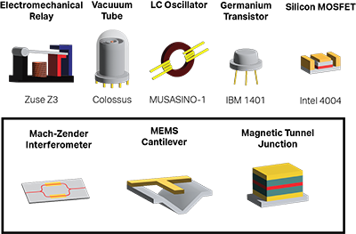

Links to and summaries of recent publications:

[*Modeling Performance of Data Collection Systems for High-Energy Physics*](https://arxiv.org/abs/2407.00123)

Computing through multiple, specialized components is one approach to continue offering increased performance per watt as Moore's Law continues to slow down. But when you put one of these new components in a large system - such as the data acquisition system at the LHC which processes terabytes of data per second - how does this affect how much power you'll save, how much data you'll process, and the quality of that data? We develop a framework to quantitatively estimate these trade-offs and estimate the impacts of multiple potential changes to data processing at the LHC. 

[*Hyperdimensional Computing Provides a Programming Paradigm for Oscillatory Systems*](https://arxiv.org/abs/2312.11783)

How can devices which oscillate - anything from a pendulum to a photon - be used to compute? We demonstrate how oscillators can be linked in circuits to compute multiple applications including graph compression, factorization, and neural networks driven by continuous, time-varying analog signals. 

[*Deep Phasor Networks*](https://arxiv.org/pdf/2106.11908): How can we meaningfully draw connections between biological and artificial neural networks? Biological networks famously communicate with 'spikes,' while artificial networks utilize real-valued numbers. By interpreting spikes as representing a phase, we demonstrate that one network with set parameters can execute equivalently via spiking or real-valued activations. [Code](https://github.com/wilkieolin/phasor_networks)

[*Bridge Networks*](https://dl.acm.org/doi/pdf/10.1145/3477145.3477161): Many architectures in artificial intelligence depend on knowing statistics - such as a number of classes - which may not be known about a dataset beforehand. This is one requirement which biological networks do not face. To address this discrepancy, we demonstrate a biologically-inspired 'bridge' network architecture which learns general correlations between features such as 'images' and 'labels' and can support an arbitrary number of classes. Furthermore, this bridge network can support multiple modes of activity, such as classification, generation, and replay-assisted learning. [Code](https://github.com/wilkieolin/bridge_networks)

[*A Dual-Memory Architecture for Reinforcement Learning on Neuromorphic Platforms*](https://iopscience.iop.org/article/10.1088/2634-4386/ac1a64/pdf): Can we implement a biologically-inspired reinforcement learning system on a neuromorphic chip? To address this challenge, we designed and implemented a model for reinforcement learning implemented on the Intel Loihi neuromorphic chip. This model utilized two 'memory' segments - one slow, one fast - to enable spike-based reinforcement learning entirely on-chip. The tasks of the multi-arm bandit, a maze, and blackjack were demonstrated. [Code](https://github.com/wilkieolin/loihi_rl)

[*Stochasticity and Robustness in Spiking Neural Networks*](https://www.sciencedirect.com/science/article/am/pii/S0925231220313035): Randomness - or more precisely, stochasticity - is a feature of biological neural networks seen in neurons, synapses, and neural circuits. Far from being a 'bug' of biological systems, stochasticity appears to be a feature which can improve network performance. To demonstrate this, we investigated the use of stochasticity in training spiking neural networks and its impact on the robustness of these networks to weight perturbation. Using these results, we demonstrated that networks trained under stochastic conditions are likelier to have improved robustness.

[*Cellular Memristive-Output Reservoir (CMOR)*](https://arxiv.org/pdf/1906.06414): Reservoir computing is a computing strategy which uses a complex dynamical system ('reservoir') to generate non-linear features from an input dataset. Given a large enough reservoir, features in the reservoir may emerge which can be used to classify non-linear features of an input dataset. To demonstrate this principle in practice, we implemented a mixed analog/digital cellular-automata based reservoir system in a 14-nm CMOS process; integrated front-end memristors served as an analog 'read-out' layer to the digital reservoir. Testing the fabricated integrated circuits, we demonstrated that a memristor-based readout of the reservoir was able to carry out a non-linear classification problem on the inputs (XOR). 